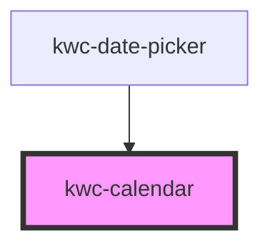

# kwc-calendar

<!-- Auto Generated Below -->

## Properties

| Property | Attribute | Description | Type             | Default |
| -------- | --------- | ----------- | ---------------- | ------- |
| `locale` | `locale`  |             | `string`         | `null`  |
| `value`  | `value`   |             | `Date \| string` | `null`  |

## Events

| Event           | Description | Type                                                                                |
| --------------- | ----------- | ----------------------------------------------------------------------------------- |
| `value-changed` |             | `CustomEvent<{ localization: KwcDateLocalization; kwcDate: KwcDate; date: Date; }>` |

## Dependencies

### Used by

 - [kwc-date-picker](../kwc-date-picker)

### Graph

----------------------------------------------

*Built with [StencilJS](https://stenciljs.com/)*
