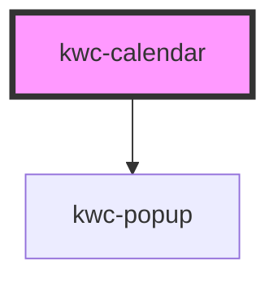

# kwc-calendar

<!-- Auto Generated Below -->

## Properties

| Property             | Attribute               | Description | Type                  | Default    |
| -------------------- | ----------------------- | ----------- | --------------------- | ---------- |
| `adjustPopupToInput` | `adjust-popup-to-input` |             | `boolean`             | `false`    |
| `locale`             | `locale`                |             | `string`              | `null`     |
| `mode`               | `mode`                  |             | `"popup" \| "static"` | `'static'` |
| `popupOffset`        | `popup-offset`          |             | `number`              | `4`        |
| `value`              | `value`                 |             | `Date \| string`      | `null`     |

## Events

| Event           | Description | Type                |
| --------------- | ----------- | ------------------- |
| `value-changed` |             | `CustomEvent<Date>` |

## Shadow Parts

| Part                       | Description |
| -------------------------- | ----------- |
| `"arrow"`                  |             |
| `"calendar-input"`         |             |
| `"calendar-input-wrapper"` |             |
| `"calendar-popup-header"`  |             |
| `"day-of-week"`            |             |
| `"header-date"`            |             |
| `"left"`                   |             |
| `"right"`                  |             |

## Dependencies

### Depends on

- [kwc-popup](../kwc-popup)

### Graph

----------------------------------------------

*Built with [StencilJS](https://stenciljs.com/)*
