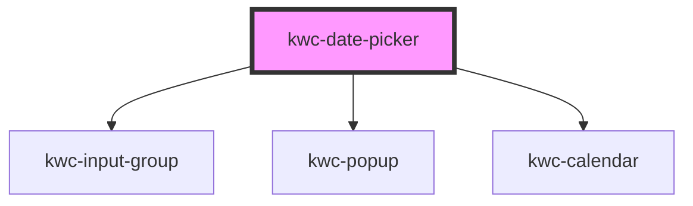

# kwc-date-picker

<!-- Auto Generated Below -->

## Properties

| Property             | Attribute               | Description | Type             | Default |
| -------------------- | ----------------------- | ----------- | ---------------- | ------- |
| `adjustPopupToInput` | `adjust-popup-to-input` |             | `boolean`        | `false` |
| `inline`             | `inline`                |             | `boolean`        | `false` |
| `locale`             | `locale`                |             | `string`         | `null`  |
| `popupOffsetY`       | `popup-offset-y`        |             | `number`         | `0`     |
| `value`              | `value`                 |             | `Date \| string` | `null`  |

## Events

| Event          | Description | Type                |
| -------------- | ----------- | ------------------- |
| `valueChanged` |             | `CustomEvent<Date>` |

## Dependencies

### Depends on

- [kwc-input-group](../kwc-input-group)
- [kwc-popup](../kwc-popup)
- [kwc-calendar](../kwc-calendar)

### Graph

----------------------------------------------

*Built with [StencilJS](https://stenciljs.com/)*
