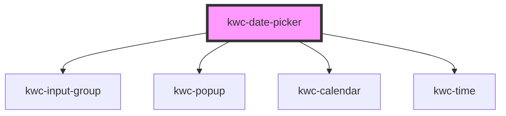

# kwc-date-picker

<!-- Auto Generated Below -->

## Properties

| Property             | Attribute               | Description | Type                                                                               | Default     |
| -------------------- | ----------------------- | ----------- | ---------------------------------------------------------------------------------- | ----------- |
| `adjustPopupToInput` | `adjust-popup-to-input` |             | `boolean`                                                                          | `false`     |
| `pt`                 | `pt`                    |             | `{ calendar: { locale: string; }; popup: { offsetY: number; inline: boolean; }; }` | `undefined` |
| `type`               | `type`                  |             | `"date" \| "datetime" \| "time"`                                                   | `'date'`    |
| `value`              | `value`                 |             | `Date \| string`                                                                   | `null`      |

## Events

| Event          | Description | Type                |
| -------------- | ----------- | ------------------- |
| `valueChanged` |             | `CustomEvent<Date>` |

## Dependencies

### Depends on

- [kwc-input-group](../kwc-input-group)
- [kwc-popup](../kwc-popup)
- [kwc-calendar](../kwc-calendar)
- [kwc-time](../kwc-time)

### Graph

----------------------------------------------

*Built with [StencilJS](https://stenciljs.com/)*
