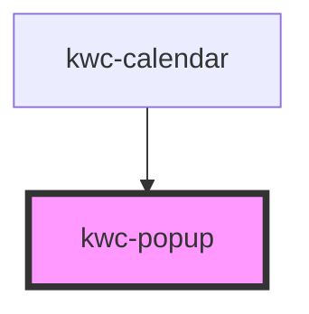

# kwc-popup

<!-- Auto Generated Below -->

## Properties

| Property | Attribute | Description | Type                  | Default   |
| -------- | --------- | ----------- | --------------------- | --------- |
| `mode`   | `mode`    |             | `"popup" \| "static"` | `'popup'` |

## Methods

### `adjustWidth(adjustWidthEl: HTMLElement) => Promise<void>`

#### Parameters

| Name            | Type          | Description |
| --------------- | ------------- | ----------- |
| `adjustWidthEl` | `HTMLElement` |             |

#### Returns

Type: `Promise<void>`

### `close() => Promise<void>`

#### Returns

Type: `Promise<void>`

### `isOpen() => Promise<boolean>`

#### Returns

Type: `Promise<boolean>`

### `open(anchorEl: HTMLElement, offset: number) => Promise<void>`

#### Parameters

| Name       | Type          | Description |
| ---------- | ------------- | ----------- |
| `anchorEl` | `HTMLElement` |             |
| `offset`   | `number`      |             |

#### Returns

Type: `Promise<void>`

### `registerCloseOutside(closeOutsideEl: HTMLElement) => Promise<void>`

#### Parameters

| Name             | Type          | Description |
| ---------------- | ------------- | ----------- |
| `closeOutsideEl` | `HTMLElement` |             |

#### Returns

Type: `Promise<void>`

## Shadow Parts

| Part      | Description |
| --------- | ----------- |
| `"popup"` |             |

## Dependencies

### Used by

 - [kwc-calendar](../kwc-calendar)

### Graph

----------------------------------------------

*Built with [StencilJS](https://stenciljs.com/)*
