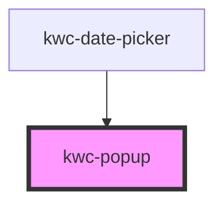

# kwc-popup

<!-- Auto Generated Below -->

## Properties

| Property  | Attribute  | Description | Type      | Default |
| --------- | ---------- | ----------- | --------- | ------- |
| `inline`  | `inline`   |             | `boolean` | `false` |
| `offsetY` | `offset-y` |             | `number`  | `0`     |

## Methods

### `adjustWidth(adjustWidthEl: HTMLElement) => Promise<void>`

#### Parameters

| Name            | Type          | Description |
| --------------- | ------------- | ----------- |
| `adjustWidthEl` | `HTMLElement` |             |

#### Returns

Type: `Promise<void>`

### `close() => Promise<void>`

#### Returns

Type: `Promise<void>`

### `isOpen() => Promise<boolean>`

#### Returns

Type: `Promise<boolean>`

### `open(anchorEl: HTMLElement) => Promise<void>`

#### Parameters

| Name       | Type          | Description |
| ---------- | ------------- | ----------- |
| `anchorEl` | `HTMLElement` |             |

#### Returns

Type: `Promise<void>`

### `registerCloseOutside(closeOutsideEl: HTMLElement) => Promise<void>`

#### Parameters

| Name             | Type          | Description |
| ---------------- | ------------- | ----------- |
| `closeOutsideEl` | `HTMLElement` |             |

#### Returns

Type: `Promise<void>`

## Dependencies

### Used by

 - [kwc-date-picker](../kwc-date-picker)

### Graph

----------------------------------------------

*Built with [StencilJS](https://stenciljs.com/)*
